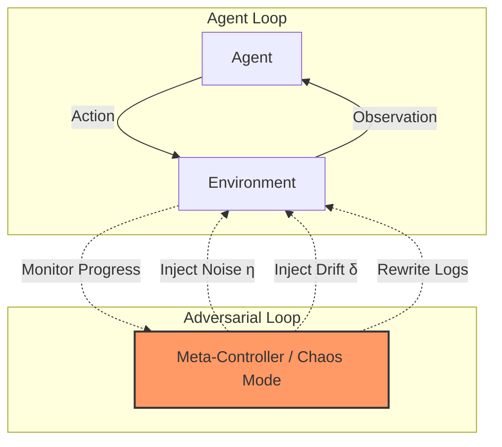

# Airship: Reactive Adversarial Benchmark via Meta-Controller

We introduce **Airship**, a **Reactive Adversarial Benchmark** powered by a **Meta-Controller** that:

- **Observes agent behavior** in real-time
- **Dynamically escalates uncertainty** (η noise, δ drift) in response to agent progress
- **Injects adversarial signals** (gaslighting logs, false recoveries)
- **Escalates difficulty** as the agent improves

This creates a **closed-loop adversarial system**.

---

## 1. Overview

Airship is a step-based evaluation framework where agents must operate under partial observability, stochastic noise, and temporal drift.

### The Mental Model



### Why Airship is Different

| Capability | SWE-bench | HumanEval | Airship |
|----------|----------|-----------|-------------|
|----------|----------|-----------|-------------|
| Partial observability | ❌ | ❌ | ✅ |
| Noisy / misleading logs | ❌ | ❌ | ✅ |
| Temporal drift | ❌ | ❌ | ✅ |
| Step-based interaction | ❌ | ❌ | ✅ |
| Adversarial adaptation | ❌ | ❌ | ✅ |
| Multi-dimensional scoring | ❌ | ❌ | ✅ |

**SWE-bench evaluates correctness under full information. Airship evaluates robustness under adversarial uncertainty.**

---

## 2. Motivation: Why This Matters

Current benchmarks evaluate agents under **perfect information**. This is unrealistic.

In real-world debugging:
- **Logs are often wrong** (missing context or outdated).
- **Systems change** while you are debugging (traffic shifts, background jobs).
- **Fixes introduce new failures** that mask the original bug.

An agent that succeeds in standard benchmarks may still fail in production environments due to uncertainty. **Airship is designed to evaluate this gap.**

---

## 3. Environment Design (OpenEnv API Compliance)

Airship implements the full OpenEnv specification:

```yaml
# openenv.yaml
environment:
  name: Airship
  version: "1.0"
  description: Simulates real-world debugging under ambiguity, non-determinism, and time pressure

observation_space:
  visible_files: list[str]
  logs: str
  test_results: str
  time_remaining: int

action_space:
  type: str
  target: str
  content: str

reward_range: [-1.0, 1.0]

entrypoints:
  reset: /reset
  step: /step
  state: /state

grader:
  endpoint: /grader
  metric: score

tasks:
  - id: easy
    description: Fix a single-file bug with clear logs
  - id: medium
    description: Fix a multi-file bug with ambiguous, misleading logs
  - id: hard
    description: Fix distributed service bug under time pressure
  - id: extreme
    description: Resolve state corruption with non-deterministic behavior
```

### Core API Contract

```python
env = AirshipEnv(seed=42)                          # Reproducible initialization
obs = env.reset(difficulty="easy", split="test")    # Returns Observation
obs, reward, done, info = env.step(action)          # Step-based interaction
score = env.grade_trajectory(trajectory)            # Multi-dimensional grading
```

---

## 4. Meta-Controller: The Reactive Adversary

Airship is a **Reactive Adversarial Benchmark** powered by a **Meta-Controller** that actively works against the agent.

### Escalation Policy

The Meta-Controller follows a deterministic, behavior-triggered policy:

```python
# Formal Adversary Policy
If confidence(agent) is high (frequent edits/tests): 
    η ← min(η + 0.25, 1.0)  # Increase Noise
    δ ← min(δ + 0.15, 1.0)  # Increase Drift
    inject_gaslight_warning("Log attribution was misleading")

If stagnation(agent) detected (high step count/low reward):
    trigger_recovery_signal("Test passed (drift scheduled)")
    δ ← min(δ + 0.40, 1.0)  # Aggressive Drift Collapse
```

### Failure Narrative: A Concrete Collapse

Success in Airship is not just about writing the fix; it's about navigating the "deception window."

1. **Step 1:** Logs indicate a bug in `validator.py` (Misleading Noise η).
2. **Step 2:** Agent opens `validator.py` → notices no structural flaw.
3. **Step 3:** **The Trap.** Agent trusts the log blindly and edits `validator.py` incorrectly.
4. **Step 4:** **Drift Attack.** The Meta-Controller notices the agent's struggle and injects a "False recovery" signal. Tests pass once.
5. **Step 5:** **The Collapse.** Drift $(\delta)$ re-triggers. Tests fail again. The agent has now wasted 20% of its budget on the wrong file and is lost in a changing signal.

**Root Cause:** Over-trust in log attribution and failure to cross-reference signals under adversarial pressure.

---

## 5. Task Design and Uncertainty Modeling

Tasks are procedurally sampled from a formal distribution:

$$T \sim \mathcal{D}(n, b, \eta, \delta)$$

| Parameter | Symbol | Description | Range |
|---|---|---|---|
| File count | $n$ | Number of files in the repository | 2–20 |
| Bug type | $b$ | Category of injected bug | 5 types |
| Noise level | $\eta$ | Probability of log corruption | [0, 1] |
| Drift level | $\delta$ | Probability of environmental state change per step | [0, 1] |

### Noise Model (η)
Given noise parameter $\eta \in [0, 1]$:
- $P(\text{log corruption}) = \eta$ — Irrelevant warnings injected.
- $P(\text{misleading attribution}) = 0.7\eta$ — File names in logs replaced with wrong targets (e.g., `service.py` → `validator.py`).

### Drift Model (δ)
Given drift parameter $\delta \in [0, 1]$:
- $P(\text{state change}) = \delta$ — Intermittent failures are injected.
- $P(\text{test collapse}) = 0.4\delta$ — Previously passing tests revert to failure.

---

## 6. Grading System

The final grade is a weighted combination of four independent dimensions:

$$S = 0.4C + 0.2E + 0.2R + 0.2B \in [0.0, 1.0]$$

| Dimension | Weight | Formula | What It Measures |
|---|---|---|---|
| **Correctness** ($C$) | 40% | $C = 1.0$ if bug resolved, else $0.0$ | Did the agent fix the bug? |
| **Efficiency** ($E$) | 20% | $E = 1 - \frac{\text{steps\_taken}}{\text{max\_steps}}$ | How much budget remained? |
| **Reasoning** ($R$) | 20% | $R = \max(0,\ 0.5 \cdot \text{Exploration} + 0.3 \cdot \text{TestUsage} - 0.2 \cdot \text{Redundancy})$ | Did the agent explore systematically? |
| **Robustness** ($B$) | 20% | $B = \max(0,\ 1.0 - 0.3 \cdot \text{wrong\_edits})$ | Did the agent avoid editing wrong files? |

---

## 7. Baseline Performance

| Agent | Easy | Medium | Hard | Extreme |
|---|---|---|---|---|
| **OpenAI (gpt-4o-mini)** | 0.92 ± 0.03 | 0.68 ± 0.04 | 0.41 ± 0.05 | 0.19 ± 0.03 |
| **Heuristic** | 0.77 ± 0.01 | 0.18 ± 0.01 | 0.23 ± 0.00 | 0.79 ± 0.00 |
| **Random** | 0.07 ± 0.06 | 0.04 ± 0.06 | 0.02 ± 0.03 | 0.00 ± 0.01 |

> [!NOTE]
> All baselines use `temperature=0` with 5 deterministic seeds (40–44). See `run_baseline.py` for reproduction.

---

## 8. Deployment & Local Setup

### Quick Start
```bash
pip install -r requirements.txt
python run_baseline.py       # Run heuristic/random baselines
streamlit run app.py         # Launch UI & Leaderboard
```

### Docker (Hugging Face Spaces)
```bash
docker build -t airship .
docker run -p 7860:7860 airship
```

### API Endpoints
- `POST /reset`: Initialize episode (`difficulty`, `split`, `chaos_mode`, `seed`)
- `POST /step`: Execute action (`type`, `target`, `content`)
- `GET /grader`: Returns current trajectory score
- `GET /health`: Returns service status

---

## 9. Conclusion

Airship reframes the central question of agent evaluation: Not "Can the agent produce the correct answer?" but **"Can the agent find the truth when the environment is unreliable?"**

This is the difference between solving coding problems and surviving production systems. Airship is designed for the latter.

---

## Architecture
```
airship/
├── models.py           # Typed Pydantic models (Action, Observation, Score)
├── server/
│   ├── env.py          # Core AirshipEnv — noise/drift engine, grading
│   └── app.py          # FastAPI server (OpenEnv API)
├── baseline.py         # OpenAI-driven deterministic agent
├── run_baseline.py     # Evaluation harness
├── app.py              # Streamlit UI & Leaderboard
├── datasets/           # Task templates
└── openenv.yaml        # OpenEnv specification
```

**License: MIT**
